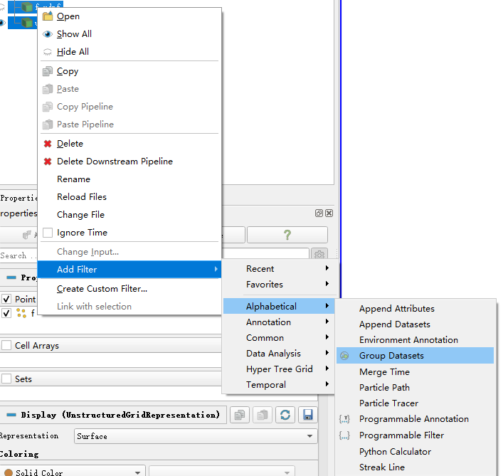

在管道浏览器中选择两个数据集，然后应用可编程过滤器。

两个输入定义在一个 inputs 数组中。此数组中元素的顺序由在Pipeline Browser 中选择数据源的顺序决定 。因此，inputs[0] 是选择的第一个数据源，inputs[1]是第二个。

https://blog.csdn.net/haimianjie2012/article/details/122718221

inputs[0].PointData['Normals']
inputs[0].CellData['Result']
# Code for ‘Script’
# ‘inputs’ is set to an array with data objects produced by inputs to
# this filter.
# Get the first input.
#input0 = inputs[0]
print(len(inputs))
# compute a value.
dataArray = sum(inputs[0].CellData['Result'])
# ‘output’ is a variable set to the output dataset.
output.FieldData.append(len(inputs), 'V_sum')
output.CellData.append(dataArray, 'V_sum')

更改 paraview 中的 axis 
paraview 5.11.2 版本中可以更改坐标轴整体的大小和文字的颜色，但是无法更改坐标轴的粗细和颜色。
paraview 5.12.0可以更改坐标轴颜色，隐藏其中一个坐标轴等等

https://discourse.paraview.org/t/change-axis-size-and-color/3355
https://discourse.paraview.org/t/improvements-to-orientation-axis/12687

paraview可以用group  datasets把两个数据集合并在一起

paraview 中的一些名词: 

Tabs: 菜单

Colormap controls: 调色

Views: 视图

Pipeline: 流程

Properties: 属性

Selection: 选择

Window splitting: 多窗口

renderview area: 渲染结果

Data Legend: 数据图例

Filter: 滤镜